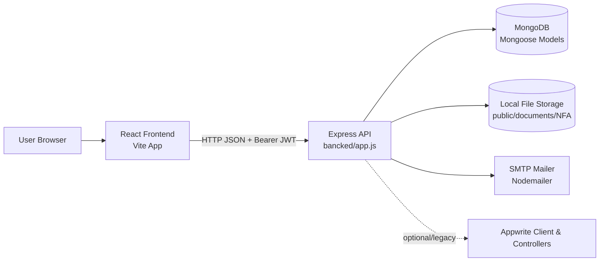

# AGENTS.md

## 1. Purpose

This repository is a two-app Node/React codebase for National Film Awards workflows:

- `bancked/`: Express + MongoDB backend API
- `nfa-project-frontend/`: React + Vite frontend

AI agents should use this document to make changes that match the repo's existing architecture, preserve the current API/UI contract, and avoid accidental regressions in the multi-step submission flows.

The codebase has working patterns, but many of them are implicit rather than enforced by tooling. Agents must prefer consistency with the observed production path over introducing new abstractions opportunistically.

## 2. Architecture Overview

### System Design

- Overall style: split frontend/backend monorepo with a layered backend and a route/page driven frontend.
- Backend architecture is a pragmatic layered monolith:
  - `routes/` define endpoints
  - `controllers/` contain request orchestration
  - `models/` hold Mongoose schemas
  - `helpers/` and `services/` contain validation and shared logic
  - `middleware/` handles auth and uploads
- Frontend architecture is page-first with feature folders:
  - `pages/` define route-level screens
  - `component/` contains large form sections and layout pieces
  - `hooks/` wrap shared query/auth behavior
  - `common/services/` centralizes API calls and toasts
  - `store/` contains small Redux slices for cross-page UI state

### Module Boundaries

- Backend production path currently uses `routes/mongoDBRoutes/*` and `controllers/mongoDBController/*`.
- `routes/appWriteRoutes/*` and `controllers/appWriteController/*` exist, but are not wired in `bancked/app.js`. Treat them as legacy or dormant code unless a task explicitly revives Appwrite-backed flows.
- Core backend domain areas:
  - auth and password reset
  - film submission and step progression
  - nested contributors/documents for feature and non-feature entries
  - best book / film critic submissions
  - payment support
- Frontend domain areas mirror backend flows:
  - auth
  - dashboard
  - feature film submission
  - non-feature film submission
  - best book
  - film critic

### Dependency Rules

- Backend dependency direction should remain:
  - route -> controller -> model/helper/service
  - middleware may depend on utils/models
  - models must not import controllers or routes
- Frontend dependency direction should remain:
  - page -> component/hook/service
  - components may use hooks and `common/services`
  - low-level service modules must not import page components
- Reuse existing shared utilities before adding new global helpers.
- Keep feature-specific logic close to that feature unless two or more active flows already share it.

### Data Flow

- Frontend calls backend through `src/common/services/axiosService.js` and `requestService.js`.
- Auth token is stored in `localStorage` and attached through the Axios request interceptor.
- The backend returns JSON with a body-level `statusCode` that the frontend relies on heavily.
- Multi-step forms persist each step to MongoDB and use `active_step` plus route `:id` state to resume progress.
- File uploads are accepted in memory via Multer, then written to `bancked/public/documents/<websiteType>/` and recorded in MongoDB documents.

## 3. Non-Negotiable Rules

### Architecture Guardrails

- Do not move active Mongo-backed flows into Appwrite code unless the task explicitly requires a platform migration.
- Do not add new backend features under `routes/appWriteRoutes/` unless the route is also intentionally wired into `app.js`.
- Do not bypass controllers by putting business logic directly in routes.
- Do not introduce controller-to-controller imports.
- Do not duplicate step numbers in ad hoc constants. Use `bancked/services/common.js` as the source of truth for step sequencing.

### API Contract Guardrails

- Preserve the existing response shape unless the task explicitly authorizes coordinated frontend/backend changes.
- Many frontend paths inspect body `statusCode` rather than HTTP status alone. Do not "clean up" status handling in only one layer.
- When changing request/response fields, update both the backend controller/model mapping and the frontend form/request mapping together.
- Preserve existing route prefixes:
  - auth under `/api/user/*`
  - film under `/api/film/*`
  - shared lookup endpoints under `/api/*`

### Data and File Safety

- Do not edit files under `bancked/public/documents/` manually. Treat them as uploaded runtime artifacts.
- Do not hardcode secrets, JWT keys, mail credentials, Appwrite IDs, or absolute production URLs in new code.
- Do not rely on fallback secrets in production code. If auth behavior changes, require real env-backed configuration.
- Keep file upload handling compatible with the current `multer.memoryStorage()` + `Common.imageUpload()` flow unless intentionally refactoring both upload and persistence paths.

### Scope Guardrails

- Preserve the existing folder names, including `bancked/`, unless renaming is explicitly requested. Tooling and workflows already reference that path.
- Avoid large-scale routing rewrites unless the task is specifically about router cleanup. Current routes contain duplication and the safest default is targeted change.
- Avoid silent schema changes. Any Mongoose schema update must be matched with controller mapping and affected frontend forms.

## 4. Coding Standards

### Naming Conventions

- Backend files predominantly use:
  - routes: lowercase or camel-ish filenames like `filmSubmission.js`
  - controllers: camelCase or descriptive names ending in `Controller.js`
  - models: mixed casing, including legacy names such as `BestFilmCritic.js`, `Payment.js`, `featureForm.js`
- Frontend files predominantly use:
  - pages/components: `.jsx`
  - hooks/services/helpers: `.js` or `.jsx`
  - component filenames are inconsistent today; preserve surrounding conventions instead of renaming broadly
- Prefer descriptive names over terse abbreviations.
- Match the local style of the folder you are editing rather than applying a repo-wide rename.

### File Organization Rules

- Backend:
  - add endpoints in `routes/...`
  - keep request validation near helpers or controller entrypoints
  - keep persistence in Mongoose models
  - put shared procedural logic in `helpers/` or `services/`
- Frontend:
  - route screens belong in `pages/`
  - multi-step form sections belong in `component/<feature>-component/`
  - HTTP access belongs in `common/services/`
  - shared query/auth wrappers belong in `hooks/`

### Function and Component Expectations

- Keep route handlers focused on request parsing, validation, orchestration, and response shaping.
- If a controller function becomes too large, extract pure helper functions rather than moving logic into routes.
- Frontend components should keep validation in `zod` + `react-hook-form` when editing existing forms.
- Prefer extending existing service/hook patterns before introducing a second way to fetch data.

### Comments

- Add comments only when the logic is non-obvious.
- Do not add banner comments or restate obvious code.
- Preserve useful domain comments that explain step meaning or document upload semantics.

### Error Handling

- Backend currently mixes HTTP status codes with body-level `statusCode`. Preserve compatibility.
- For new validation failures, follow the stronger existing pattern:
  - HTTP `422`
  - `{ message, errors, statusCode: 422 }`
- For compatibility-sensitive flows, check how the frontend currently interprets the response before changing status semantics.
- Frontend should continue routing API calls through the shared Axios instance so loader and auth handling remain consistent.

### Logging

- Existing code uses `console.log` and `console.error` sparingly. Do not add noisy logs in hot paths.
- Remove debug logs you introduce unless they are intentionally helpful in development.
- Never log tokens, passwords, OTPs, or sensitive identifiers in new code.

### Validation

- Backend validation convention: Zod helpers in `bancked/helpers/*`.
- Frontend form validation convention: component-local Zod schema + `zodResolver`.
- If you add or change a field:
  - update frontend schema
  - update request payload mapping
  - update backend schema/helper validation
  - update controller persistence

### Async and Concurrency

- Use `async/await`; that is the dominant style across backend and frontend services/hooks.
- Avoid parallel writes to the same submission document unless the controller is explicitly designed for it.
- Be careful with step progression updates; `active_step` acts as workflow state and can be regressed accidentally.

### Configuration

- Backend uses `process.env`.
- Frontend uses `import.meta.env`, especially `VITE_API_URL`.
- New configuration must be env-driven and should not be duplicated across multiple modules when a shared accessor exists.

## 5. Testing Requirements

### Current State

- There are no repository-authored unit or integration tests in the active source tree at the time of review.
- CI is configured to run tests if present, but the current packages do not define meaningful test suites.

### Expectations for New Changes

- Tests are mandatory when:
  - changing validation logic
  - changing auth behavior
  - changing step progression logic
  - changing payload/response mapping
  - changing document upload behavior
  - fixing a regression that can be isolated
- Prefer:
  - frontend: Vitest for utility/hooks/component logic
  - backend: add targeted Node-based tests around helpers/validation first if full HTTP tests are too heavy for the change

### Test Naming

- Follow the default ecosystem pattern if adding tests:
  - `*.test.js`
  - `*.test.jsx`
  - `*.spec.js`
- Place tests next to the unit they cover or in a nearby `__tests__` folder. Be consistent within the touched area.

### Coverage Expectations

- No global coverage threshold is enforced today.
- For risky changes, cover the changed logic directly rather than adding broad shallow tests.
- Minimum expectation for AI-generated changes: validate the exact branch or regression being touched.

## 6. Change Protocol for AI Agents

### Adding a New Feature

1. Identify whether the feature belongs to the active Mongo flow or the dormant Appwrite flow.
2. Add backend route/controller/model changes first if the feature requires persistence.
3. Mirror any new fields in frontend form schema, request mapping, and edit/view rendering.
4. Reuse existing auth, loader, request, and toast infrastructure.
5. If the feature is step-based, update the shared step constants and the frontend step order together.

### Refactoring Safely

- Refactor one vertical slice at a time.
- Preserve response shape and local naming unless the task explicitly includes cleanup.
- Do not rename endpoints, env vars, or persisted fields without checking all frontend call sites.
- For router cleanup, first remove duplication only when you can confirm path parity.

### Introducing a New Dependency

- Add a dependency only if the current stack cannot reasonably solve the problem.
- Prefer existing libraries already in use:
  - frontend forms: `react-hook-form`, `zod`
  - frontend data fetching: `@tanstack/react-query`, Axios
  - backend validation: `zod`
  - backend persistence: Mongoose
- Avoid adding a second library for problems already solved elsewhere in the repo.

### Modifying Database Schema

- Update the relevant Mongoose model.
- Update every controller that reads/writes the field.
- Update frontend request builders and reset/default value logic if the field is user-facing.
- Confirm compatibility for existing documents by using defaults or tolerant reads.
- Do not remove or rename persisted fields casually; prefer additive changes unless a migration is in scope.

### Updating APIs

- Keep endpoint naming aligned with existing style.
- Preserve auth middleware usage for protected routes.
- If the frontend consumes `statusCode` from the body, keep it aligned with existing expectations.
- Update `axiosService` exclusions only if the auth requirement of a route truly changes.

### Required Validation Before Completion

- Run the relevant lint/build commands for touched apps when feasible:
  - frontend: `npm run lint`, `npm run build`
  - backend: `npm run lint` if an ESLint config exists and is functional for the changed files
- Manually trace all touched request/response fields across frontend and backend.
- For auth or step-flow changes, verify resume/edit behavior, not just create behavior.

## 7. Definition of Done for AI Contributions

- [ ] Change fits the active Mongo-based architecture or explicitly documents why it does not
- [ ] No new circular dependency or controller-to-controller coupling introduced
- [ ] Frontend and backend contracts remain aligned
- [ ] New or changed fields are validated in every layer that uses them
- [ ] Protected routes still enforce auth where required
- [ ] No hardcoded secrets, tokens, OTPs, or environment-specific URLs introduced
- [ ] Uploaded file behavior remains compatible with current storage conventions
- [ ] Step-based flows still preserve `active_step` correctly
- [ ] Lint/build run for affected app when feasible, or inability to run is documented
- [ ] Tests added for risky logic, or testing gap is explicitly called out
- [ ] Backward compatibility reviewed for route names, response shape, and persisted fields

## 8. Example Good vs Bad Contributions

### Good

- Adding a new film field by updating:
  - `featureForm` Mongoose schema
  - frontend Zod schema for the relevant step
  - form default/reset mapping for edit mode
  - request payload builder
  - controller persistence and response shaping
- Extending a protected API by adding `requireAuth`, using Zod validation, and returning the existing `{ message, statusCode, data }` shape.
- Extracting repeated upload/document logic into a helper while preserving `Common.imageUpload()` compatibility.
- Writing a small Vitest test for a new formatter/helper or a backend validation helper before changing behavior.

### Bad

- Implementing a new Mongo-backed feature inside `controllers/appWriteController/*` because the folder already exists.
- Changing backend errors to "proper" HTTP 4xx/5xx statuses everywhere without also updating the frontend, which currently depends on body `statusCode`.
- Renaming `bancked/` to `backend/` or renaming API fields for style reasons.
- Updating step numbers in a single component without also updating `bancked/services/common.js` and any resume logic.
- Storing auth state in yet another browser storage key or creating a second Axios client that bypasses interceptors.
- Editing files in `public/documents/` as if they were source assets.

## 9. Known Risk Areas

These areas deserve extra caution during AI-assisted work:

- Auth flows contain inconsistencies between middleware, user schema, and controller assumptions.
- Response semantics are inconsistent but relied upon by the frontend.
- Router declarations in the frontend contain duplication.
- Step constants and per-step UI/controller behavior can drift out of sync.
- The repo contains dormant Appwrite code that looks live at first glance.
- Testing is minimal, so contract regressions are easy to introduce silently.

When in doubt, make the smallest change that preserves the existing vertical slice end to end.

## 10. Technical Reference Appendix

This appendix consolidates the concrete implementation notes that were previously documented separately in `agent.md`, so this file can serve as the single high-signal reference for both repository rules and current technical context.

### Architecture Snapshot

- Frontend app: `nfa-project-frontend` using React + Vite
- Backend app: `bancked` using Express + MongoDB/Mongoose
- Domain coverage includes:
  - feature films
  - non-feature films
  - best book on cinema
  - best film critic on cinema

### Runtime Shape

### Frontend Stack and Behavior

- React 19
- Vite 6
- React Router v7 with `createBrowserRouter`
- Redux Toolkit
- TanStack React Query
- Axios with interceptors
- React Hook Form + Zod
- MUI, Bootstrap, Swiper, Sonner

Current frontend behavior:

- Router is defined in `nfa-project-frontend/src/App.jsx`
- Auth state is managed through the auth provider and `localStorage`
- The Axios request interceptor attaches `Authorization: Bearer <token>` for protected requests
- The response interceptor handles `401` by clearing auth state and redirecting to login
- The API base URL comes from `import.meta.env.VITE_API_URL`

### Backend Stack and Behavior

- Node.js with ES modules
- Express 4
- Mongoose 6
- `jsonwebtoken`
- `bcrypt`
- `multer` with memory storage
- `nodemailer`
- `morgan`, `cors`, `cookie-parser`, `express-rate-limit`
- optional or legacy Redis/Appwrite code paths

Current backend behavior:

- App wiring lives in `bancked/app.js` and `bancked/server.js`
- Active routes are mounted from `bancked/routes/mongoDBRoutes`
- Active controllers live in `bancked/controllers/mongoDBController`
- Shared step and upload utilities live in `bancked/services/common.js`
- JWT auth is enforced via `bancked/middleware/requireAuth.js`

### Authentication Flow Reference

1. `POST /api/user/register` creates a user with a hashed password.
2. `POST /api/user/login` verifies credentials and returns a JWT plus user data.
3. Protected routes use `requireAuth`, which reads the Bearer token, verifies it, and attaches `req.user`.
4. Password recovery uses the `forgot-password`, `verify-otp`, `resend-otp`, and `reset-password` route sequence.

### Active API Surface Reference

Base URL is supplied by the frontend through `VITE_API_URL`.

| Method | Endpoint | Mounted From | Auth Required | Purpose |
|---|---|---|---|---|
| POST | `/api/user/register` | auth.js | No | Register user |
| POST | `/api/user/login` | auth.js | No | Login and receive JWT |
| POST | `/api/user/verify-email` | auth.js | No | Validate email before login |
| POST | `/api/user/forgot-password` | auth.js | No | Generate/send OTP |
| POST | `/api/user/verify-otp` | auth.js | No | Verify OTP |
| POST | `/api/user/resend-otp` | auth.js | No | Resend OTP |
| POST | `/api/user/reset-password` | auth.js | No | Reset password after OTP |
| POST | `/api/user/change-password` | auth.js | Yes | Change password |
| GET | `/api/get-languages` | languages.js | Yes | Master language list |
| GET | `/api/entry-list` | entryList.js | Yes | Dashboard entry aggregation |
| POST | `/api/film/feature-create` | filmSubmission.js | Yes | Create feature film entry |
| GET | `/api/film/entry-list` | filmSubmission.js | Yes | List feature/non-feature entries |
| POST | `/api/film/feature-update` | filmSubmission.js | Yes | Step-wise feature update |
| GET | `/api/film/feature-entry-by/:id` | filmSubmission.js | Yes | Feature entry details |
| POST | `/api/film/non-feature-create` | filmSubmission.js | Yes | Create non-feature entry |
| GET | `/api/film/non-feature-list` | filmSubmission.js | Yes | List non-feature entries |
| GET | `/api/film/non-feature-entry-by/:id` | filmSubmission.js | Yes | Non-feature entry details |
| POST | `/api/film/non-feature-update` | filmSubmission.js | Yes | Step-wise non-feature update |
| POST | `/api/film/final-submit` | filmSubmission.js | Yes | Final form submission |
| POST | `/api/film/producer-list` | filmSubmission.js | Yes | List producers |
| POST | `/api/film/store-producer` | filmSubmission.js | Yes | Add producer |
| POST | `/api/film/delete-producer` | filmSubmission.js | Yes | Delete producer |
| POST | `/api/film/director-list` | filmSubmission.js | Yes | List directors |
| POST | `/api/film/store-director` | filmSubmission.js | Yes | Add director |
| POST | `/api/film/delete-director` | filmSubmission.js | Yes | Delete director |
| POST | `/api/film/actor-list` | filmSubmission.js | Yes | List actors |
| POST | `/api/film/store-actor` | filmSubmission.js | Yes | Add actor |
| POST | `/api/film/delete-actor` | filmSubmission.js | Yes | Delete actor |
| POST | `/api/film/song-list` | filmSubmission.js | Yes | List songs |
| POST | `/api/film/store-song` | filmSubmission.js | Yes | Add song |
| POST | `/api/film/delete-song` | filmSubmission.js | Yes | Delete song |
| POST | `/api/film/audiographer-list` | filmSubmission.js | Yes | List audiographers |
| POST | `/api/film/store-audiographer` | filmSubmission.js | Yes | Add audiographer |
| POST | `/api/film/delete-audiographer` | filmSubmission.js | Yes | Delete audiographer |
| POST | `/api/create-entry` | apiRoutes.js | Yes | Create best film critic entry |
| GET | `/api/best-film-critic-entry-by/:id` | apiRoutes.js | Yes | Get best film critic entry |
| POST | `/api/update-entry` | apiRoutes.js | Yes | Update best film critic entry |
| POST | `/api/best-film-critic-final-submit` | apiRoutes.js | Yes | Final submit best film critic |
| POST | `/api/best-book-cinema-entry` | apiRoutes.js | Yes | Create best book entry |
| POST | `/api/best-book-cinema-update` | apiRoutes.js | Yes | Update best book entry |
| POST | `/api/best-book-cinema-final-submit` | apiRoutes.js | Yes | Final submit best book entry |
| GET | `/api/best-book-cinema-entry-by/:id` | apiRoutes.js | Yes | Get best book entry |
| POST | `/api/store-book` | apiRoutes.js | Yes | Add book |
| POST | `/api/update-book` | apiRoutes.js | Yes | Update book |
| POST | `/api/list-book` | apiRoutes.js | Yes | List books |
| GET | `/api/get-book-by/:id` | apiRoutes.js | Yes | Book details |
| GET | `/api/delete-book/:id` | apiRoutes.js | Yes | Delete book |
| POST | `/api/store-editor` | apiRoutes.js | Yes | Add editor/publisher |
| POST | `/api/update-editor` | apiRoutes.js | Yes | Update editor/publisher |
| POST | `/api/list-editor` | apiRoutes.js | Yes | List editors/publishers |
| GET | `/api/delete-editor/:id` | apiRoutes.js | Yes | Delete editor/publisher |
| POST | `/api/generate-hash` | apiRoutes.js | Yes | Create payment record and mark paid |

### Dormant Route Note

- `bancked/routes/appWriteRoutes/*` contains additional Appwrite-oriented routes, but these are not part of the active production path unless `bancked/app.js` is intentionally changed to mount them.

### Environment and Runbook

Prerequisites:

- Node.js 18+ and preferably Node.js 20
- npm
- MongoDB connection string

Backend setup:

1. `cd bancked`
2. `npm install`
3. Configure environment values such as:
   - `NODE_ENV`
   - `PORT`
   - `DB_URL`
   - `JWT_SECRET`
   - `MAIL_USERNAME`
   - `MAIL_PASSWORD`
   - `FRONTEND_BASE_URL`
4. Run development or start commands already defined in `bancked/package.json`

Frontend setup:

1. `cd nfa-project-frontend`
2. `npm install`
3. Set `VITE_API_URL` to the backend `/api` base URL
4. Use the existing `dev`, `build`, and preview scripts from `nfa-project-frontend/package.json`

### Deployment Reference

- CI/CD is defined in `.github/workflows/deploy.yml`
- The workflow installs dependencies, builds the frontend, and triggers deploy hooks
- Backend Docker files exist in `bancked/`, including dev and prod compose variants
- Compose environment filename expectations should be verified before relying on them unchanged

### Existing Improvement Backlog

These are observations, not standing instructions. Treat them as candidates for deliberate work, not opportunistic cleanup during unrelated tasks.

1. Remove or clearly isolate dormant Appwrite code if it is not meant to be revived.
2. Add `.env.example` files and ensure secrets are not committed.
3. Audit OTP and change-password flows carefully before modifying auth behavior.
4. Standardize inconsistent status handling only as a coordinated frontend/backend change.
5. Add targeted tests around auth, validation, step progression, and payload mapping.
6. Tighten production CORS and configuration handling.
